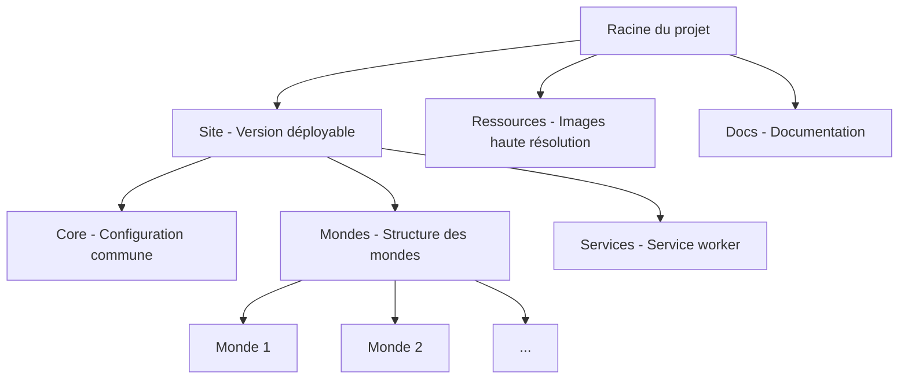
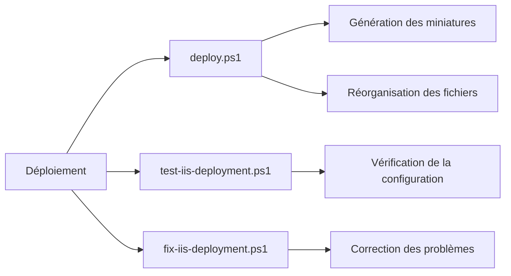

# Documentation du Projet Malvinaland

Ce document fournit une documentation complète du projet Malvinaland, un jeu de piste immersif conçu pour la maison de campagne à Sabres. Il explique l'architecture globale du site, la structure des dossiers, le processus de déploiement sur IIS et les bonnes pratiques pour la maintenance et les mises à jour.

## Table des matières

1. [Architecture globale du site](#architecture-globale-du-site)
2. [Structure des dossiers et leur rôle](#structure-des-dossiers-et-leur-rôle)
3. [Processus de déploiement sur IIS](#processus-de-déploiement-sur-iis)
4. [Bonnes pratiques pour la maintenance et les mises à jour](#bonnes-pratiques-pour-la-maintenance-et-les-mises-à-jour)

## Architecture globale du site

### Vue d'ensemble

Malvinaland est un jeu de piste immersif organisé en différents "mondes" qui représentent des lieux physiques dans une propriété. Le site web sert de support à cette expérience en fournissant des informations sur chaque monde, des énigmes à résoudre et une carte interactive pour naviguer entre les mondes.

### Architecture technique



Le projet est divisé en deux parties principales :
1. **Site web déployable (léger)** : Contient tous les fichiers nécessaires au fonctionnement du site, avec des miniatures d'images pour optimiser les performances.
2. **Ressources volumineuses** : Contient les images haute résolution qui sont chargées à la demande.

### Fonctionnement du chargement différé des images

Le site utilise un système de chargement différé des images pour optimiser les performances :
1. Les images haute résolution sont stockées dans le dossier `ressources/images/`
2. Des miniatures légères sont générées et stockées dans les dossiers `thumbnails/` de chaque monde
3. Le script `image-loader.js` détecte les images avec l'attribut `data-high-res` et les charge en arrière-plan lorsque :
   - L'utilisateur survole l'image avec la souris
   - L'utilisateur clique sur l'image
   - L'image devient visible dans la fenêtre du navigateur

Exemple d'utilisation dans le HTML :
```html

```

### Configuration des mondes

Chaque monde est défini dans le fichier `Core/mondes-config.js` avec les propriétés suivantes :
- **id** : Identifiant unique utilisé dans les URLs et les références
- **nom** : Nom complet du monde affiché à l'utilisateur
- **couleur** : Code couleur hexadécimal associé au monde
- **icone** : Emoji ou caractère représentant le monde
- **description** : Brève description du monde
- **position** : Informations sur la position du monde sur la carte et ses voisins

Cette configuration est utilisée par le système de navigation et d'autres composants du site pour générer dynamiquement le contenu et les liens.

## Structure des dossiers et leur rôle

### Structure principale

```
Les mondes de Malvinha/
│
├── site/                           # Site web déployable (léger)
│   ├── index.html                  # Page de redirection vers Core/index.html
│   ├── web.config                  # Configuration IIS
│   ├── Core/                       # Configuration et navigation communes
│   │   ├── mondes-config.js
│   │   ├── navigation.js
│   │   ├── image-loader.js         # Script de chargement différé des images
│   │   └── index.html              # Page d'accueil principale
│   │
│   ├── Mondes/                     # Structure légère des mondes
│   │   ├── Carte de Malvinaland stylisée.png  # Image essentielle
│   │   ├── web.config
│   │   │
│   │   ├── Le monde de l'assemblée/
│   │   │   ├── index.html
│   │   │   ├── script.js
│   │   │   ├── styles.css
│   │   │   └── thumbnails/         # Miniatures des images (légères)
│   │   │
│   │   └── [Autres mondes...]
│   │
│   └── Services/                   # Service worker pour le fonctionnement hors ligne
│       ├── serviceWorker.js
│       └── sw.js
│
├── ressources/                     # Ressources volumineuses (non déployées)
│   └── images/                     # Images haute résolution
│       ├── Le monde de l'assemblée/
│       ├── Le monde de la grange/
│       └── [Autres mondes...]
│
└── docs/                           # Documentation et fichiers de développement
```

### Description des dossiers clés

#### Dossier `site/`

Ce dossier contient la version déployable du site, conçue pour être légère et optimisée pour le web :

- `index.html` : Page de redirection vers Core/index.html
- `web.config` : Configuration IIS pour le site
- `app.js` : Script JavaScript principal du site

#### Dossier `site/Core/`

Contient les éléments communs à tous les mondes :

- `mondes-config.js` : Configuration des mondes (identifiants, noms, couleurs, etc.)
- `navigation.js` : Gestion de la navigation desktop et mobile
- `image-loader.js` : Script de chargement différé des images
- `index.html` : Page d'accueil principale du site
- `styles.css` : Styles CSS communs

#### Dossier `site/Mondes/`

Contient un sous-dossier pour chaque monde, avec la structure suivante pour chaque monde :

- `index.html` : Page principale du monde
- `script.js` : Scripts spécifiques au monde
- `styles.css` : Styles spécifiques au monde
- `thumbnails/` : Miniatures des images du monde

#### Dossier `site/Services/`

Contient les scripts pour le fonctionnement hors ligne du site :

- `serviceWorker.js` : Script d'enregistrement du service worker
- `sw.js` : Implémentation du service worker

#### Dossier `ressources/`

Contient les ressources volumineuses qui ne sont pas déployées directement sur le serveur web :

- `images/` : Images haute résolution organisées par monde

#### Dossier `docs/`

Contient la documentation et les fichiers de développement :

- Documentation technique
- Guides d'utilisation
- Fichiers de conception

## Processus de déploiement sur IIS

### Prérequis

- Windows Server avec IIS installé
- Module URL Rewrite pour IIS (pour la redirection HTTPS)
- PowerShell 5.1 ou supérieur
- .NET Framework 4.5 ou supérieur (pour la manipulation des images)
- Droits d'administrateur sur le serveur de déploiement

### Processus de déploiement automatisé



Le déploiement est géré par trois scripts PowerShell :

1. **deploy.ps1** : Réorganise la structure du projet et génère des miniatures pour les images
   - Crée la structure de dossiers nécessaire
   - Copie les fichiers dans les bons dossiers
   - Génère des miniatures pour les images
   - Met à jour les références dans les fichiers HTML

2. **test-iis-deployment.ps1** : Vérifie la configuration IIS et teste l'accès aux fichiers clés
   - Vérifie si IIS est installé et en cours d'exécution
   - Vérifie si le module URL Rewrite est installé
   - Vérifie si le site Malvinaland existe dans IIS
   - Teste l'accès aux URLs principales du site

3. **fix-iis-deployment.ps1** : Corrige les problèmes courants de déploiement IIS
   - Configure le site IIS pour Malvinaland
   - Configure les autorisations du dossier pour le groupe IIS_IUSRS
   - Installe le module URL Rewrite si nécessaire
   - Corrige la structure des fichiers si nécessaire

### Étapes de déploiement manuel

1. **Préparation**
   - Cloner ou télécharger le projet complet
   - Ouvrir une console PowerShell en tant qu'administrateur
   - Se positionner dans le répertoire racine du projet

2. **Exécution du script de déploiement**
   ```powershell
   .\deploy.ps1
   ```

3. **Vérification**
   - Vérifier que la structure de dossiers a été correctement créée
   - Vérifier que les miniatures ont été générées dans les dossiers `thumbnails/`
   - Vérifier que les images haute résolution ont été déplacées dans le dossier `ressources/images/`

4. **Déploiement sur le serveur web**
   - Copier uniquement le dossier `site/` sur le serveur web dans le répertoire racine du site IIS
   - Conserver le dossier `ressources/` sur un stockage local ou un serveur de fichiers séparé

5. **Configuration IIS**
   - Dans IIS Manager, créer un nouveau site web ou utiliser un site existant
   - Configurer le chemin physique vers le dossier `site/` copié
   - Définir le nom d'hôte à `malvinaland.myia.io`
   - Configurer HTTPS avec un certificat SSL valide
   - Ajouter les autorisations de lecture et d'exécution pour le groupe `IIS_IUSRS` sur le dossier du site

6. **Vérification du déploiement**
   - Exécuter le script `test-iis-deployment.ps1` pour vérifier la configuration
   - Accéder à https://malvinaland.myia.io/ pour vérifier que le site fonctionne correctement
   - Tester la navigation entre les différents mondes

### Configuration web.config

Le fichier `web.config` à la racine du site contient la configuration IIS suivante :

- Document par défaut : `index.html`
- Compression HTTP pour différents types MIME
- Règle de réécriture pour rediriger HTTP vers HTTPS
- En-têtes HTTP personnalisés pour la sécurité

## Bonnes pratiques pour la maintenance et les mises à jour

### Maintenance régulière

1. **Surveillance du serveur**
   - Vérifier régulièrement les logs IIS pour détecter d'éventuels problèmes
   - Surveiller l'utilisation des ressources du serveur (CPU, mémoire, espace disque)
   - Vérifier que le certificat SSL est valide et à jour

2. **Tests de fonctionnement**
   - Tester périodiquement l'accès au site depuis différents appareils et navigateurs
   - Vérifier que toutes les fonctionnalités du site fonctionnent correctement
   - Tester le chargement des images haute résolution

3. **Sauvegardes**
   - Effectuer des sauvegardes régulières du site et de sa configuration
   - Documenter toutes les modifications apportées à la configuration IIS
   - Conserver des copies des images haute résolution

### Mise à jour du contenu

1. **Ajout de nouvelles images**
   - Placer les images haute résolution dans le dossier `ressources/images/[Nom du monde]/`
   - Exécuter à nouveau le script `deploy.ps1` pour générer les miniatures
   - Mettre à jour les références dans les fichiers HTML

2. **Ajout d'un nouveau monde**
   - Créer le dossier du monde dans la structure existante
   - Ajouter les fichiers HTML, JS et CSS nécessaires
   - Ajouter les images dans le dossier `ressources/images/[Nouveau monde]/`
   - Mettre à jour le fichier `Core/mondes-config.js` pour inclure le nouveau monde
   - Exécuter le script `deploy.ps1` pour générer la structure complète

3. **Mise à jour du site**
   - Utiliser le script `deploy.ps1` à la racine du projet pour générer une nouvelle version déployable
   - Sauvegarder le site existant avant de déployer la nouvelle version
   - Copier uniquement les fichiers modifiés pour minimiser les temps d'arrêt

### Résolution des problèmes courants

1. **Les miniatures ne sont pas générées**
   - Vérifier que le .NET Framework est correctement installé
   - Vérifier les droits d'accès aux dossiers
   - Consulter les logs d'erreur générés par le script

2. **Les images haute résolution ne se chargent pas**
   - Vérifier que les chemins relatifs sont corrects dans les attributs `data-high-res`
   - Vérifier que le script `image-loader.js` est bien chargé dans les pages HTML
   - Vérifier la console du navigateur pour d'éventuelles erreurs JavaScript

3. **Erreurs lors de l'exécution du script de déploiement**
   - Exécuter PowerShell en tant qu'administrateur
   - Vérifier la politique d'exécution PowerShell avec la commande `Get-ExecutionPolicy`
   - Si nécessaire, modifier la politique avec `Set-ExecutionPolicy -ExecutionPolicy Bypass -Scope Process`

4. **Problèmes d'accès au site**
   - Vérifier que le site est démarré dans IIS Manager
   - Vérifier que les autorisations sont correctement définies pour l'utilisateur IIS
   - Vérifier que le module URL Rewrite est installé pour la redirection HTTPS
   - Consulter les logs IIS dans `%SystemDrive%\inetpub\logs\LogFiles`

## Dernières modifications et corrections

### Amélioration de la structure du site

La structure du site a été améliorée pour résoudre les problèmes de navigation et simplifier la maintenance:

1. **Élimination de la redirection dans la page d'accueil**
  - **Problème**: La page d'accueil (Site/index.html) utilisait une redirection via meta refresh vers Site/Core/index.html, ce qui créait une confusion dans les chemins relatifs.
  - **Solution**: Remplacement de la redirection par le contenu direct de Site/Core/index.html avec les chemins relatifs ajustés.

2. **Uniformisation des chemins relatifs**
  - **Problème**: Les chemins vers les ressources (scripts, styles, images) étaient incohérents entre les différentes pages.
  - **Solution**: Ajustement de tous les chemins relatifs pour qu'ils fonctionnent correctement depuis la racine du site.

3. **Simplification de la navigation entre les pages**
  - **Problème**: La navigation entre les pages était complexe en raison de la structure imbriquée des dossiers.
  - **Solution**: Simplification de la navigation en plaçant les pages principales à la racine du site.

### Simplification du système de navigation JavaScript

Le système de navigation JavaScript a été simplifié pour résoudre plusieurs problèmes qui affectaient la fluidité de la navigation:

1. **Simplification du script navigation.js**
  - Suppression des fonctionnalités redondantes
  - Optimisation des animations et des transitions
  - Amélioration de la gestion des événements de défilement

2. **Résolution du conflit entre app.js et navigation.js**
  - Suppression du gestionnaire d'événements pour les liens de navigation dans app.js
  - Centralisation de la gestion de la navigation dans navigation.js

3. **Correction des incohérences de chemins de fichiers**
  - Uniformisation des chemins vers app.js dans toutes les pages
  - Correction du chemin dans Site/Core/carte.html (de "app.js" à "../app.js")

4. **Création d'un guide de maintenance**
  - Documentation des problèmes courants et de leurs solutions
  - Bonnes pratiques pour les futures mises à jour
  - Instructions pour l'optimisation des performances

Ces modifications ont permis d'améliorer la stabilité et la fluidité de la navigation sur le site, tout en facilitant la maintenance future du code.

### Problèmes résolus

1. **Redirection inefficace de la page d'accueil**
  - **Problème**: La page d'accueil utilisait une redirection via meta refresh, ce qui n'est pas une bonne pratique et peut causer des problèmes de navigation.
  - **Solution**: Remplacement de la redirection par le contenu direct avec les chemins relatifs ajustés.

2. **Conflit entre scripts JavaScript**
  - **Problème**: Les scripts app.js et navigation.js tentaient tous deux de gérer les événements de clic sur les liens de navigation, causant des comportements imprévisibles.
  - **Solution**: Suppression du gestionnaire d'événements redondant dans app.js et centralisation de la gestion de la navigation dans navigation.js.

3. **Incohérences de chemins de fichiers**
  - **Problème**: Les chemins vers les ressources étaient incohérents entre les différentes pages, causant des erreurs de chargement.
  - **Solution**: Uniformisation des chemins relatifs dans toutes les pages.

4. **Complexité excessive du script de navigation**
  - **Problème**: Le script navigation.js contenait des fonctionnalités redondantes et des optimisations excessives qui rendaient le code difficile à maintenir.
  - **Solution**: Simplification du script en conservant uniquement les fonctionnalités essentielles et en améliorant la lisibilité du code.

### Recommandations pour les futures mises à jour

1. **Maintenir une structure de site cohérente**
  - Éviter les redirections inutiles
  - Placer les pages principales à la racine du site
  - Organiser les ressources de manière logique

2. **Éviter les conflits entre scripts**
  - S'assurer que chaque fonctionnalité est gérée par un seul script
  - Documenter clairement les responsabilités de chaque script

3. **Maintenir la cohérence des chemins de fichiers**
  - Utiliser des chemins relatifs cohérents dans toutes les pages
  - Vérifier les chemins après chaque modification de la structure du site

4. **Simplifier le code JavaScript**
  - Privilégier la lisibilité et la maintenabilité à l'optimisation excessive
  - Commenter clairement le code pour faciliter la compréhension

5. **Tester régulièrement la navigation**
  - Vérifier que tous les liens fonctionnent correctement
  - Tester sur différents navigateurs et appareils
  - Utiliser les outils de développement pour détecter les erreurs JavaScript