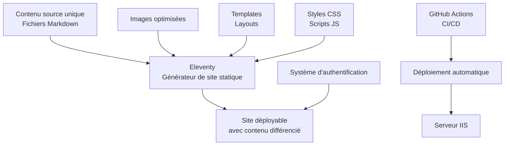
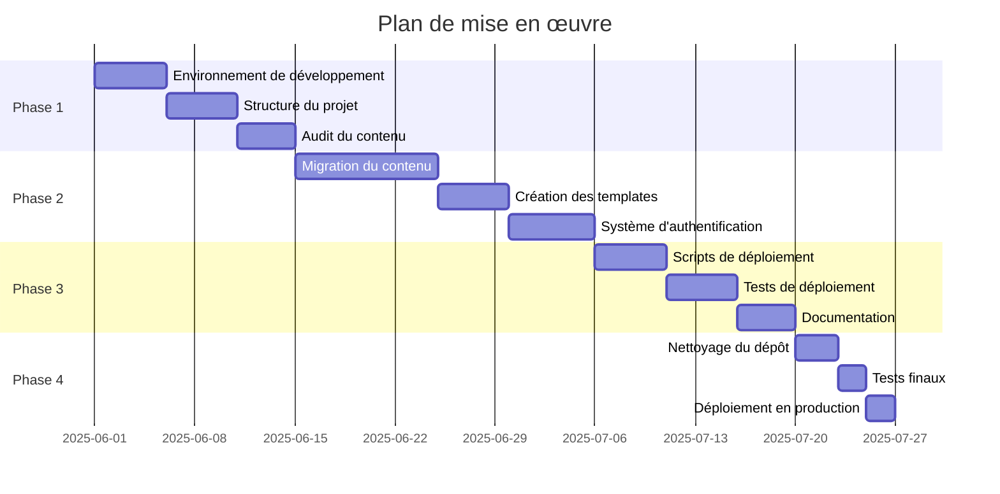

# Architecture de Malvinaland - Mécanisme de déploiement automatique et séparation du contenu

## Table des matières

1. [Vue d'ensemble](#vue-densemble)
2. [Architecture proposée](#architecture-proposée)
3. [Mécanisme de déploiement automatique](#mécanisme-de-déploiement-automatique)
4. [Séparation du contenu joueurs/organisateurs](#séparation-du-contenu-joueursorganisateurs)
5. [Nettoyage du dépôt](#nettoyage-du-dépôt)
6. [Documentation du processus](#documentation-du-processus)
7. [Plan de mise en œuvre](#plan-de-mise-en-œuvre)

## Vue d'ensemble

### Problèmes identifiés

Après analyse du projet Malvinaland, plusieurs problèmes ont été identifiés :

1. **Duplication de contenu** : Le contenu existe à la fois en Markdown et en HTML
2. **Mélange du contenu** : Pas de séparation claire entre contenu joueurs et organisateurs
3. **Images cassées** : Problèmes de référencement des images
4. **Dépôt surchargé** : Plus de 2000 fichiers nécessitant un nettoyage
5. **Déploiement manuel** : Pas de processus automatisé pour générer le site

### Objectifs

1. Concevoir un mécanisme de déploiement automatique
2. Proposer une structure permettant de séparer le contenu pour les joueurs et les organisateurs
3. Nettoyer le dépôt
4. Documenter le processus
## Architecture proposée

### Vue d'ensemble de l'architecture



### Structure du projet proposée

```
malvinaland/
├── src/                          # Sources du site
│   ├── _data/                    # Données globales
│   │   ├── mondes.js             # Configuration des mondes
│   │   ├── navigation.js         # Structure de navigation
│   │   └── site.js               # Configuration du site
│   ├── _includes/                # Templates réutilisables
│   │   ├── layouts/              # Layouts de base
│   │   │   ├── base.njk          # Layout de base
│   │   │   ├── monde.njk         # Layout pour les mondes
│   │   │   └── organisateur.njk  # Layout pour les pages organisateurs
│   │   ├── components/           # Composants réutilisables
│   │   │   ├── navigation.njk    # Navigation principale
│   │   │   ├── footer.njk        # Pied de page
│   │   │   └── monde-card.njk    # Carte de monde
│   ├── assets/                   # Ressources statiques
│   │   ├── images/               # Images optimisées
│   │   │   ├── mondes/           # Images des mondes
│   │   │   └── carte/            # Images de la carte
│   │   ├── css/                  # Styles CSS
│   │   │   ├── main.css          # Styles principaux
│   │   │   ├── monde.css         # Styles pour les mondes
│   │   │   └── organisateur.css  # Styles pour les organisateurs
│   │   ├── js/                   # Scripts JavaScript
│   │   │   ├── navigation.js     # Script de navigation
│   │   │   ├── image-loader.js   # Chargement différé des images
│   │   │   └── auth.js           # Authentification
│   ├── content/                  # Contenu source unique
│   │   ├── index.md              # Page d'accueil
│   │   ├── carte.md              # Page de la carte
│   │   ├── mondes/               # Contenu des mondes
│   │   │   ├── assemblee/        # Un monde par dossier
│   │   │   │   ├── index.md      # Contenu principal
│   │   │   │   ├── enigmes.md    # Énigmes du monde
│   │   │   │   └── images/       # Images spécifiques au monde
│   │   │   └── [autres mondes]/
│   │   ├── narration/            # Contenu narratif
│   │   │   └── index.md
│   │   ├── organisateurs/        # Contenu réservé aux organisateurs
│   │   │   ├── index.md          # Accueil organisateurs
│   │   │   ├── pnj/              # Personnages non-joueurs
│   │   │   │   ├── index.md      # Liste des PNJ
│   │   │   │   └── [fiches PNJ]/
│   │   │   └── notes/            # Notes pour les organisateurs
│   │   └── login.md              # Page de connexion
│   ├── admin/                    # Interface d'administration (Netlify CMS)
│   │   ├── index.html            # Page d'administration
│   │   └── config.yml            # Configuration du CMS
│   └── .eleventy.js              # Configuration d'Eleventy
├── scripts/                      # Scripts de déploiement
│   ├── deploy.ps1                # Script de déploiement principal
│   ├── optimize-images.js        # Script d'optimisation des images
│   └── clean-repository.ps1      # Script de nettoyage du dépôt
## Mécanisme de déploiement automatique

### Générateur de site statique : 11ty (Eleventy)

11ty est un générateur de site statique simple et flexible qui convient parfaitement à ce projet pour plusieurs raisons :

1. **Simplicité** : Facile à configurer et à utiliser
2. **Support natif du Markdown** : Parfait pour le contenu source
3. **Flexibilité des templates** : Supporte plusieurs langages de template (Nunjucks, Liquid, etc.)
4. **Performances** : Génération rapide du site
5. **Intégration facile** : S'intègre bien avec les outils existants

#### Configuration d'Eleventy

```javascript
// .eleventy.js
const { DateTime } = require("luxon");
const markdownIt = require("markdown-it");
const markdownItContainer = require("markdown-it-container");

module.exports = function(eleventyConfig) {
  // Copier les fichiers statiques
  eleventyConfig.addPassthroughCopy("src/assets");
  
  // Configuration du Markdown
  const mdOptions = {
    html: true,
    breaks: true,
    linkify: true
  };
  
  // Créer une instance de markdown-it
  const md = markdownIt(mdOptions)
    // Plugin pour les conteneurs personnalisés
    .use(markdownItContainer, "organisateurs-only", {
      validate: function(params) {
        return params.trim() === "organisateurs-only";
      },
      render: function(tokens, idx) {
        if (tokens[idx].nesting === 1) {
          return '<div class="organisateurs-only">\n';
        } else {
          return '</div>\n';
        }
      }
    });
  
  eleventyConfig.setLibrary("md", md);
  
  // Filtres personnalisés
  eleventyConfig.addFilter("readableDate", dateObj => {
    return DateTime.fromJSDate(dateObj, {zone: 'utc'}).toFormat("dd/MM/yyyy");
  });
  
  // Collections personnalisées
  eleventyConfig.addCollection("mondes", function(collectionApi) {
    return collectionApi.getFilteredByGlob("src/content/mondes/*/index.md");
  });
  
  eleventyConfig.addCollection("organisateurs", function(collectionApi) {
    return collectionApi.getFilteredByGlob("src/content/organisateurs/**/*.md");
  });
  
  // Configuration de base
  return {
    dir: {
      input: "src",
      output: "dist",
      includes: "_includes",
      data: "_data"
    },
    templateFormats: ["md", "njk", "html"],
    markdownTemplateEngine: "njk",
    htmlTemplateEngine: "njk",
    dataTemplateEngine: "njk"
  };
};
```

### Pipeline CI/CD avec GitHub Actions

```yaml
# .github/workflows/deploy.yml
name: Build and Deploy

on:
  push:
    branches: [ main ]
  pull_request:
    branches: [ main ]

jobs:
  build:
    runs-on: ubuntu-latest
    steps:
      - uses: actions/checkout@v3
      
      - name: Setup Node.js
        uses: actions/setup-node@v3
        with:
          node-version: '18'
          
      - name: Install dependencies
        run: npm ci
        
      - name: Build site
        run: npm run build
        
      - name: Upload artifacts
        uses: actions/upload-artifact@v3
        with:
          name: site
          path: dist/
          
  deploy:
    needs: build
    if: github.ref == 'refs/heads/main'
    runs-on: windows-latest
    steps:
      - name: Download artifacts
        uses: actions/download-artifact@v3
        with:
          name: site
          path: dist/
          
      - name: Setup PowerShell
        uses: actions/setup-powershell@v1
        
      - name: Deploy to IIS
        run: |
          # Ici, vous pouvez utiliser un script PowerShell pour déployer sur IIS
          # Par exemple, en utilisant Web Deploy ou en copiant les fichiers via SMB
          # Cette étape dépendra de votre infrastructure spécifique
```

### Script de déploiement PowerShell amélioré

```powershell
# scripts/deploy.ps1
param (
    [string]$Environment = "production",
    [switch]$IncludeOrganisateurs = $false
)

# Configuration
$rootPath = $PSScriptRoot
$buildPath = Join-Path -Path $rootPath -ChildPath "..\dist"
$iisPath = "C:\inetpub\wwwroot\malvinaland"
$siteName = "Malvinaland"

# Fonction pour afficher les messages
function Write-Step {
    param ([string]$Message)
    Write-Host "=== $Message ===" -ForegroundColor Cyan
}

# Étape 1: Installer les dépendances
Write-Step "Installation des dépendances"
npm ci

# Étape 2: Générer le site statique
Write-Step "Génération du site statique"
if ($IncludeOrganisateurs) {
    npm run build:all
} else {
    npm run build
}

# Étape 3: Optimiser les images
Write-Step "Optimisation des images"
npm run optimize-images

# Étape 4: Déployer sur IIS
Write-Step "Déploiement sur IIS"
if (Test-Path $iisPath) {
    # Sauvegarder la configuration IIS
    $webConfigPath = Join-Path -Path $iisPath -ChildPath "web.config"
    $webConfigBackupPath = Join-Path -Path $rootPath -ChildPath "web.config.backup"
    
    if (Test-Path $webConfigPath) {
        Copy-Item -Path $webConfigPath -Destination $webConfigBackupPath -Force
        Write-Host "web.config sauvegardé" -ForegroundColor Green
    }
    
    # Supprimer les fichiers existants (sauf web.config)
    Get-ChildItem -Path $iisPath -Exclude "web.config" | Remove-Item -Recurse -Force
    Write-Host "Anciens fichiers supprimés" -ForegroundColor Green
} else {
    # Créer le dossier s'il n'existe pas
    New-Item -Path $iisPath -ItemType Directory -Force | Out-Null
    Write-Host "Dossier IIS créé" -ForegroundColor Green
}

# Copier les fichiers générés
Copy-Item -Path "$buildPath\*" -Destination $iisPath -Recurse -Force
Write-Host "Fichiers copiés vers IIS" -ForegroundColor Green

# Restaurer web.config si nécessaire
if (Test-Path $webConfigBackupPath) {
    Copy-Item -Path $webConfigBackupPath -Destination $webConfigPath -Force
    Write-Host "web.config restauré" -ForegroundColor Green
}

# Configurer IIS
Import-Module WebAdministration -ErrorAction SilentlyContinue
if (Get-Module WebAdministration) {
    # Vérifier si le site existe
    $site = Get-Website | Where-Object { $_.Name -eq $siteName }
    
    if ($site) {
        # Redémarrer le site
        Restart-WebItem "IIS:\Sites\$siteName" -ErrorAction SilentlyContinue
        Write-Host "Site IIS redémarré" -ForegroundColor Green
    } else {
        Write-Host "Le site IIS '$siteName' n'existe pas. Utilisez IIS Manager pour le créer." -ForegroundColor Yellow
    }
} else {
    Write-Host "Module WebAdministration non disponible. Impossible de configurer IIS automatiquement." -ForegroundColor Yellow
}

Write-Step "Déploiement terminé"
Write-Host "Le site est accessible à l'adresse: https://malvinaland.myia.io/" -ForegroundColor Green
```

### Script d'optimisation des images

```javascript
// scripts/optimize-images.js
const sharp = require('sharp');
const fs = require('fs');
const path = require('path');
const glob = require('glob');

// Configuration
const sourceDir = path.join(__dirname, '../src/assets/images');
const outputDir = path.join(__dirname, '../dist/assets/images');
const thumbnailsDir = path.join(__dirname, '../dist/assets/thumbnails');

// Créer les répertoires de sortie s'ils n'existent pas
if (!fs.existsSync(outputDir)) {
  fs.mkdirSync(outputDir, { recursive: true });
}

if (!fs.existsSync(thumbnailsDir)) {
  fs.mkdirSync(thumbnailsDir, { recursive: true });
}

// Trouver toutes les images
const imageFiles = glob.sync(`${sourceDir}/**/*.{jpg,jpeg,png,gif}`);

// Traiter chaque image
async function processImages() {
  console.log(`Traitement de ${imageFiles.length} images...`);
  
  for (const file of imageFiles) {
    const relativePath = path.relative(sourceDir, file);
    const outputPath = path.join(outputDir, relativePath);
    const thumbnailPath = path.join(thumbnailsDir, relativePath);
    
    // Créer les répertoires de sortie pour cette image
    const outputDirForFile = path.dirname(outputPath);
    const thumbnailDirForFile = path.dirname(thumbnailPath);
    
    if (!fs.existsSync(outputDirForFile)) {
      fs.mkdirSync(outputDirForFile, { recursive: true });
    }
    
    if (!fs.existsSync(thumbnailDirForFile)) {
## Séparation du contenu joueurs/organisateurs

### Approche avec un seul site et authentification

Conformément à votre préférence, nous allons implémenter une approche avec un seul site et une authentification pour les organisateurs. Cette approche présente plusieurs avantages :

1. **Maintenance simplifiée** : Un seul codebase à maintenir
2. **Cohérence** : Interface utilisateur cohérente pour tous les utilisateurs
3. **Flexibilité** : Possibilité d'afficher ou masquer du contenu en fonction du rôle de l'utilisateur
4. **Efficacité** : Réutilisation des composants et des styles

### Séparation du contenu dans les fichiers Markdown

Chaque fichier Markdown contiendra des métadonnées indiquant si le contenu est destiné aux joueurs, aux organisateurs, ou aux deux :

```markdown
---
title: Le Monde de l'Assemblée
layout: monde
visibility: 
  - joueurs
  - organisateurs
---

## 🏞️ Introduction et description du lieu
Ce contenu est visible par tous.

::: organisateurs-only
## 🧩 Notes pour les organisateurs
Ce contenu est visible uniquement par les organisateurs.
:::

## 🎭 Ambiance et atmosphère
Ce contenu est visible par tous.
```

### Système d'authentification

Nous utiliserons une authentification simple mais sécurisée pour les organisateurs :

```javascript
// src/assets/js/auth.js
document.addEventListener('DOMContentLoaded', function() {
  // Initialiser l'authentification
  initAuth();
  
  // Afficher/masquer le contenu réservé aux organisateurs
  updateOrganisateurContent();
});

// Initialiser l'authentification
function initAuth() {
  // Vérifier si l'utilisateur est déjà authentifié
  const isAuthenticated = sessionStorage.getItem('authenticated') === 'true';
  const userRole = sessionStorage.getItem('userRole');
  
  // Mettre à jour l'interface utilisateur
  updateAuthUI(isAuthenticated, userRole);
  
  // Ajouter les gestionnaires d'événements pour le formulaire de connexion
  const loginForm = document.getElementById('login-form');
  if (loginForm) {
    loginForm.addEventListener('submit', handleLogin);
  }
  
  // Ajouter le gestionnaire d'événements pour la déconnexion
  const logoutButton = document.getElementById('logout-button');
  if (logoutButton) {
    logoutButton.addEventListener('click', handleLogout);
  }
}

// Gérer la soumission du formulaire de connexion
function handleLogin(event) {
  event.preventDefault();
  
  const username = document.getElementById('username').value;
  const password = document.getElementById('password').value;
  
  // Dans un environnement de production, cette vérification serait faite côté serveur
  // Pour ce prototype, nous utilisons une vérification côté client simple
  if (username === 'organisateur' && password === 'malvinha2025') {
    // Stocker l'authentification en session
    sessionStorage.setItem('authenticated', 'true');
    sessionStorage.setItem('userRole', 'organisateur');
    
    // Rediriger vers la page d'accueil organisateurs
    window.location.href = '/organisateurs/';
  } else {
    // Afficher un message d'erreur
    const errorMessage = document.getElementById('error-message');
    if (errorMessage) {
      errorMessage.textContent = 'Identifiants incorrects';
      errorMessage.style.display = 'block';
    }
  }
}

// Gérer la déconnexion
function handleLogout(event) {
  event.preventDefault();
  
  // Supprimer l'authentification
  sessionStorage.removeItem('authenticated');
  sessionStorage.removeItem('userRole');
  
  // Rediriger vers la page d'accueil
  window.location.href = '/';
}

// Mettre à jour l'interface utilisateur en fonction de l'état d'authentification
function updateAuthUI(isAuthenticated, userRole) {
  const authLinks = document.querySelectorAll('.auth-link');
  const orgaLinks = document.querySelectorAll('.orga-link');
  
  if (isAuthenticated && userRole === 'organisateur') {
    // Afficher les liens pour les organisateurs
    authLinks.forEach(link => {
      if (link.classList.contains('login-link')) {
        link.style.display = 'none';
      } else if (link.classList.contains('logout-link')) {
        link.style.display = 'inline-block';
      }
    });
    
    // Afficher les liens vers les pages organisateurs
    orgaLinks.forEach(link => {
      link.style.display = 'inline-block';
    });
  } else {
    // Afficher uniquement le lien de connexion
    authLinks.forEach(link => {
      if (link.classList.contains('login-link')) {
        link.style.display = 'inline-block';
      } else if (link.classList.contains('logout-link')) {
        link.style.display = 'none';
      }
    });
    
    // Masquer les liens vers les pages organisateurs
    orgaLinks.forEach(link => {
      link.style.display = 'none';
    });
  }
}

// Afficher/masquer le contenu réservé aux organisateurs
function updateOrganisateurContent() {
  const isAuthenticated = sessionStorage.getItem('authenticated') === 'true';
  const userRole = sessionStorage.getItem('userRole');
  
  const orgaContent = document.querySelectorAll('.organisateurs-only');
  
  if (isAuthenticated && userRole === 'organisateur') {
    // Afficher le contenu réservé aux organisateurs
    orgaContent.forEach(el => {
      el.style.display = 'block';
    });
  } else {
    // Masquer le contenu réservé aux organisateurs
    orgaContent.forEach(el => {
      el.style.display = 'none';
    });
  }
}
```

### Page de connexion

```html
<!-- src/content/login.md -->
---
layout: base
title: Connexion - Malvinaland
---

<div class="login-container">
  <h2>Accès Organisateurs</h2>
  <p>Cette interface est réservée aux organisateurs de Malvinaland.</p>
  
  <form id="login-form" class="login-form">
    <div id="error-message" style="display: none;"></div>
    
    <div class="form-group">
      <label for="username">Nom d'utilisateur</label>
      <input type="text" id="username" required>
    </div>
    
    <div class="form-group">
      <label for="password">Mot de passe</label>
      <input type="password" id="password" required>
    </div>
    
    <button type="submit">Se connecter</button>
  </form>
  
  <div class="login-footer">
    <p>Pour obtenir les identifiants, contactez l'organisateur du jeu.</p>
    <p><a href="/">Retour à l'accueil</a></p>
  </div>
</div>
```

### Styles CSS pour le contenu organisateurs

```css
/* src/assets/css/organisateur.css */
/* Styles pour le contenu réservé aux organisateurs */

.organisateurs-only {
  display: none; /* Masqué par défaut */
  border-left: 4px solid #e74c3c;
  padding-left: 1rem;
  margin: 1.5rem 0;
  background-color: rgba(231, 76, 60, 0.1);
}

.organisateurs-only h2,
.organisateurs-only h3,
.organisateurs-only h4 {
  color: #e74c3c;
}

/* Styles pour la page de connexion */
.login-container {
  max-width: 400px;
  margin: 2rem auto;
  padding: 2rem;
  background-color: #f8f9fa;
  border-radius: 8px;
  box-shadow: 0 4px 6px rgba(0, 0, 0, 0.1);
}

.login-form .form-group {
  margin-bottom: 1rem;
}

.login-form label {
  display: block;
  margin-bottom: 0.5rem;
  font-weight: bold;
}

.login-form input {
  width: 100%;
  padding: 0.5rem;
  border: 1px solid #ced4da;
  border-radius: 4px;
}

.login-form button {
  display: block;
  width: 100%;
  padding: 0.75rem;
  background-color: #e74c3c;
  color: white;
  border: none;
  border-radius: 4px;
  cursor: pointer;
  font-weight: bold;
}

.login-form button:hover {
  background-color: #c0392b;
}

#error-message {
  color: #e74c3c;
## Nettoyage du dépôt

### Stratégie de nettoyage

Nous adopterons une approche en plusieurs étapes pour nettoyer le dépôt :

1. **Audit des fichiers** : Identifier les fichiers dupliqués, obsolètes ou inutilisés
2. **Migration du contenu** : Transférer le contenu important vers la nouvelle structure
3. **Archivage** : Archiver les fichiers historiques qui ne sont plus nécessaires
4. **Suppression** : Supprimer les fichiers redondants après confirmation

### Script d'audit et de nettoyage

```powershell
# scripts/clean-repository.ps1

# Configuration
$rootPath = $PSScriptRoot
$archivePath = Join-Path -Path $rootPath -ChildPath "..\archive"
$reportPath = Join-Path -Path $rootPath -ChildPath "..\cleanup-report.csv"

# Créer le dossier d'archive
if (-not (Test-Path $archivePath)) {
    New-Item -Path $archivePath -ItemType Directory -Force | Out-Null
}

# Fonction pour analyser les fichiers
function Analyze-Files {
    param (
        [string]$Path,
        [string]$Pattern
    )
    
    $files = Get-ChildItem -Path $Path -Filter $Pattern -Recurse
    $report = @()
    
    foreach ($file in $files) {
        $size = (Get-Item $file.FullName).Length
        $lastModified = (Get-Item $file.FullName).LastWriteTime
        $relativePath = $file.FullName.Replace($rootPath, "").TrimStart("\")
        
        $report += [PSCustomObject]@{
            Path = $relativePath
            Size = $size
            LastModified = $lastModified
            Action = "Review"  # Par défaut, à examiner
        }
    }
    
    return $report
}

# Identifier les fichiers HTML dupliqués
$htmlFiles = Analyze-Files -Path $rootPath -Pattern "*.html"
$markdownFiles = Analyze-Files -Path $rootPath -Pattern "*.md"

# Identifier les images non référencées
$imageFiles = Analyze-Files -Path $rootPath -Pattern "*.jpg", "*.png", "*.gif", "*.jpeg"
$allContent = Get-ChildItem -Path $rootPath -Filter "*.html", "*.md", "*.css", "*.js" -Recurse | ForEach-Object { Get-Content $_.FullName }
$allContentText = $allContent -join " "

foreach ($image in $imageFiles) {
    $fileName = [System.IO.Path]::GetFileName($image.Path)
    if ($allContentText -notmatch [regex]::Escape($fileName)) {
        $image.Action = "Archive"  # Image non référencée
    }
}

# Générer le rapport
$allFiles = $htmlFiles + $markdownFiles + $imageFiles
$allFiles | Export-Csv -Path $reportPath -NoTypeInformation

Write-Host "Rapport d'analyse généré: $reportPath" -ForegroundColor Green
Write-Host "Veuillez examiner ce rapport et marquer les actions à effectuer (Keep, Archive, Delete)" -ForegroundColor Yellow
Write-Host "Puis exécutez clean-repository-execute.ps1 pour appliquer les actions" -ForegroundColor Yellow
```

## Documentation du processus

### Structure de la documentation

```
docs/
├── architecture/
│   ├── overview.md             # Vue d'ensemble de l'architecture
│   ├── content-structure.md    # Structure du contenu
│   ├── authentication.md       # Système d'authentification
├── guides/
│   ├── installation.md         # Guide d'installation
│   ├── content-editing.md      # Guide d'édition du contenu
│   ├── deployment.md           # Guide de déploiement
├── tutorials/
│   ├── add-new-monde.md        # Tutoriel pour ajouter un nouveau monde
│   ├── add-new-enigme.md       # Tutoriel pour ajouter une nouvelle énigme
│   ├── add-new-pnj.md          # Tutoriel pour ajouter un nouveau PNJ
```

### Guide d'édition du contenu (exemple)

```markdown
# Guide d'édition du contenu

Ce guide explique comment éditer le contenu du site Malvinaland.

## Structure du contenu

Le contenu est organisé en "mondes", chacun avec ses propres caractéristiques et énigmes.

### Fichiers de contenu

Chaque monde possède les fichiers suivants :
- `index.md` : Contenu principal du monde
- `enigmes.md` : Énigmes du monde
- `images/` : Images spécifiques au monde

## Édition du contenu

### Frontmatter

Chaque fichier Markdown commence par un "frontmatter" qui définit les métadonnées :

```yaml
---
title: Le Monde de l'Assemblée
layout: monde
visibility: 
  - joueurs
  - organisateurs
---
```

### Contenu visible par les joueurs

Tout le contenu standard est visible par les joueurs.

### Contenu réservé aux organisateurs

Pour ajouter du contenu visible uniquement par les organisateurs, utilisez la syntaxe suivante :

```markdown
::: organisateurs-only
Ce contenu est visible uniquement par les organisateurs.
:::
```

## Ajout d'images

1. Placez les images dans le dossier `images/` du monde correspondant
2. Référencez-les dans le contenu avec la syntaxe Markdown :

```markdown

```

## Prévisualisation des modifications

Pour prévisualiser vos modifications localement :

1. Exécutez `npm run dev`
2. Ouvrez votre navigateur à l'adresse http://localhost:8080
```

## Plan de mise en œuvre

Pour implémenter cette architecture, nous proposons une approche progressive en quatre phases :

### Phase 1 : Préparation (2 semaines)

1. **Mise en place de l'environnement de développement**
   - Installation des outils nécessaires (Node.js, npm, etc.)
   - Configuration du générateur de site statique (11ty)
   - Création des templates de base

2. **Création de la structure du projet**
   - Mise en place de la structure de dossiers
   - Configuration des scripts de build
   - Configuration du système d'authentification

3. **Audit du contenu existant**
   - Analyse des fichiers existants
   - Identification des fichiers à migrer, archiver ou supprimer
   - Génération du rapport d'audit

### Phase 2 : Migration du contenu (3 semaines)

1. **Migration du contenu des mondes**
   - Conversion des fichiers README.md en fichiers de contenu structurés
   - Séparation du contenu joueurs/organisateurs
   - Optimisation des images

2. **Création des templates**
   - Développement des templates pour les différentes pages
   - Implémentation des composants réutilisables
   - Création des styles CSS

3. **Mise en place du système d'authentification**
   - Implémentation de la page de connexion
   - Configuration du système d'authentification
   - Tests de sécurité

### Phase 3 : Automatisation (2 semaines)

1. **Développement des scripts de déploiement**
   - Création du script de déploiement principal
   - Développement du script d'optimisation des images
   - Configuration du pipeline CI/CD

2. **Tests de déploiement**
   - Tests de déploiement local
   - Tests de déploiement sur un environnement de staging
   - Correction des problèmes identifiés

3. **Documentation du processus**
   - Rédaction des guides d'installation et de déploiement
   - Documentation de l'architecture
   - Création des tutoriels pour les tâches courantes

### Phase 4 : Nettoyage et finalisation (1 semaine)

1. **Nettoyage du dépôt**
   - Archivage des fichiers obsolètes
   - Suppression des fichiers redondants
   - Optimisation de la structure du dépôt

2. **Tests finaux**
   - Tests de fonctionnalité
   - Tests de performance
   - Tests de sécurité

3. **Déploiement en production**
   - Déploiement du site sur le serveur de production
   - Vérification du bon fonctionnement
   - Formation des utilisateurs

### Diagramme de Gantt simplifié



## Conclusion

Cette architecture propose une solution complète pour répondre aux besoins de Malvinaland :

1. **Mécanisme de déploiement automatique** : Utilisation d'un générateur de site statique (11ty) avec un pipeline CI/CD pour automatiser le processus de déploiement.

2. **Séparation du contenu joueurs/organisateurs** : Mise en place d'un système d'authentification simple mais efficace pour protéger le contenu réservé aux organisateurs.

3. **Nettoyage du dépôt** : Stratégie progressive pour identifier, migrer, archiver et supprimer les fichiers redondants ou obsolètes.

4. **Documentation du processus** : Documentation complète pour faciliter la maintenance et l'évolution du site.

Cette approche permettra de résoudre les problèmes identifiés tout en offrant une base solide pour l'évolution future du projet.
  margin-bottom: 1rem;
  padding: 0.5rem;
  background-color: rgba(231, 76, 60, 0.1);
  border-radius: 4px;
}

.login-footer {
  margin-top: 2rem;
  font-size: 0.9rem;
  opacity: 0.7;
  text-align: center;
}
```
      fs.mkdirSync(thumbnailDirForFile, { recursive: true });
    }
    
    try {
      // Optimiser l'image originale
      await sharp(file)
        .jpeg({ quality: 80, progressive: true })
        .toFile(outputPath);
      
      // Créer une miniature
      await sharp(file)
        .resize(300, 200, { fit: 'inside', withoutEnlargement: true })
        .jpeg({ quality: 60, progressive: true })
        .toFile(thumbnailPath);
      
      console.log(`✓ Traité: ${relativePath}`);
    } catch (error) {
      console.error(`✗ Erreur lors du traitement de ${relativePath}: ${error.message}`);
    }
  }
  
  console.log('Optimisation des images terminée!');
}

processImages();
```
├── dist/                         # Site généré (ignoré par git)
├── node_modules/                 # Dépendances (ignorées par git)
├── .github/                      # Configuration GitHub Actions
│   └── workflows/                # Workflows CI/CD
│       └── deploy.yml            # Workflow de déploiement
├── package.json                  # Dépendances et scripts npm
├── .gitignore                    # Fichiers ignorés par git
├── README.md                     # Documentation principale
└── DOCUMENTATION.md              # Documentation détaillée
```