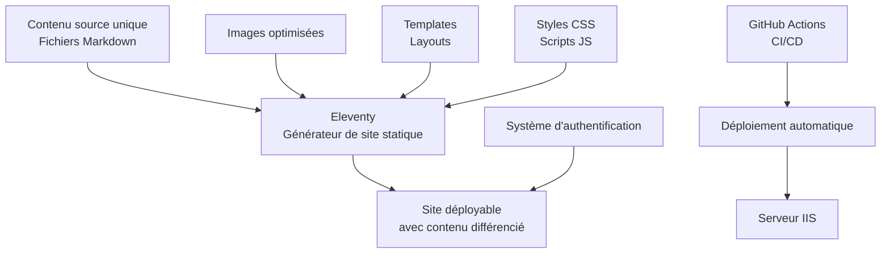

# Malvinaland - Nouvelle Architecture

Ce document résume la nouvelle architecture proposée pour le projet Malvinaland, incluant le mécanisme de déploiement automatique et la séparation du contenu joueurs/organisateurs.

## 🎯 Objectifs

1. **Automatiser le déploiement** du site à partir des contenus Markdown
2. **Séparer le contenu** destiné aux joueurs et aux organisateurs
3. **Nettoyer le dépôt** pour éliminer les fichiers redondants
4. **Documenter le processus** pour faciliter la maintenance

## 🏗️ Architecture proposée

### Vue d'ensemble



### Points clés

- **Source unique de vérité** : Tout le contenu est stocké dans des fichiers Markdown
- **Génération automatique** : Le site est généré automatiquement à partir des fichiers Markdown
- **Séparation du contenu** : Le contenu pour les joueurs et les organisateurs est séparé via un système d'authentification
- **Optimisation des images** : Les images sont automatiquement optimisées et des miniatures sont générées

## 🚀 Mécanisme de déploiement automatique

### Générateur de site statique : 11ty (Eleventy)

- **Simple et flexible** : Facile à configurer et à utiliser
- **Support natif du Markdown** : Parfait pour le contenu source
- **Performances excellentes** : Génération rapide du site

### Pipeline CI/CD

- **GitHub Actions** : Automatisation du processus de build et de déploiement
- **Tests automatisés** : Vérification de la qualité du code et du contenu
- **Déploiement sur IIS** : Script PowerShell pour déployer automatiquement sur IIS

## 🔒 Séparation du contenu joueurs/organisateurs

### Approche avec un seul site et authentification

- **Maintenance simplifiée** : Un seul codebase à maintenir
- **Cohérence** : Interface utilisateur cohérente pour tous les utilisateurs
- **Flexibilité** : Affichage conditionnel du contenu selon le rôle de l'utilisateur

### Syntaxe dans les fichiers Markdown

```markdown
---
title: Le Monde de l'Assemblée
layout: monde
visibility: 
  - joueurs
  - organisateurs
---

## 🏞️ Introduction et description du lieu
Ce contenu est visible par tous.

::: organisateurs-only
## 🧩 Notes pour les organisateurs
Ce contenu est visible uniquement par les organisateurs.
:::
```

## 🧹 Nettoyage du dépôt

### Stratégie en 4 étapes

1. **Audit des fichiers** : Identification des fichiers dupliqués, obsolètes ou inutilisés
2. **Migration du contenu** : Transfert du contenu important vers la nouvelle structure
3. **Archivage** : Conservation des fichiers historiques qui ne sont plus nécessaires
4. **Suppression** : Élimination des fichiers redondants après confirmation

## 📚 Documentation

### Structure de la documentation

```
docs/
├── architecture/       # Documentation technique
├── guides/            # Guides d'utilisation
└── tutorials/         # Tutoriels pas à pas
```

## 📅 Plan de mise en œuvre

### Phases de déploiement

1. **Préparation** (2 semaines) : Mise en place de l'environnement et audit du contenu
2. **Migration du contenu** (3 semaines) : Conversion des fichiers et création des templates
3. **Automatisation** (2 semaines) : Développement des scripts et configuration du CI/CD
4. **Nettoyage et finalisation** (1 semaine) : Nettoyage du dépôt et déploiement en production

## 🛠️ Prochaines étapes

1. **Valider l'architecture** proposée avec l'équipe
2. **Mettre en place l'environnement** de développement
3. **Commencer la migration** du contenu
4. **Former l'équipe** à la nouvelle architecture

## 📋 Ressources

- [Documentation complète](ARCHITECTURE_MALVINALAND.md) : Document détaillé de l'architecture
- [Guide d'installation](docs/guides/installation.md) : Instructions pour installer l'environnement de développement
- [Guide d'édition du contenu](docs/guides/content-editing.md) : Comment éditer le contenu du site

## 📞 Contact

Pour toute question concernant cette nouvelle architecture, veuillez contacter l'équipe de développement.